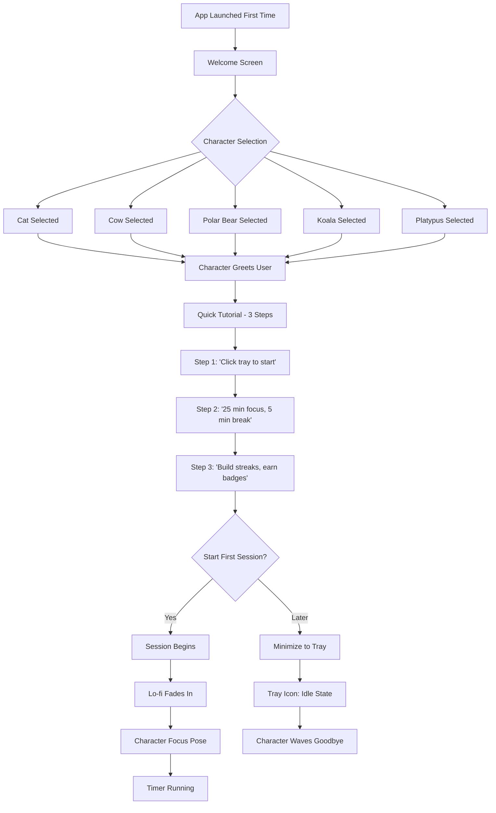
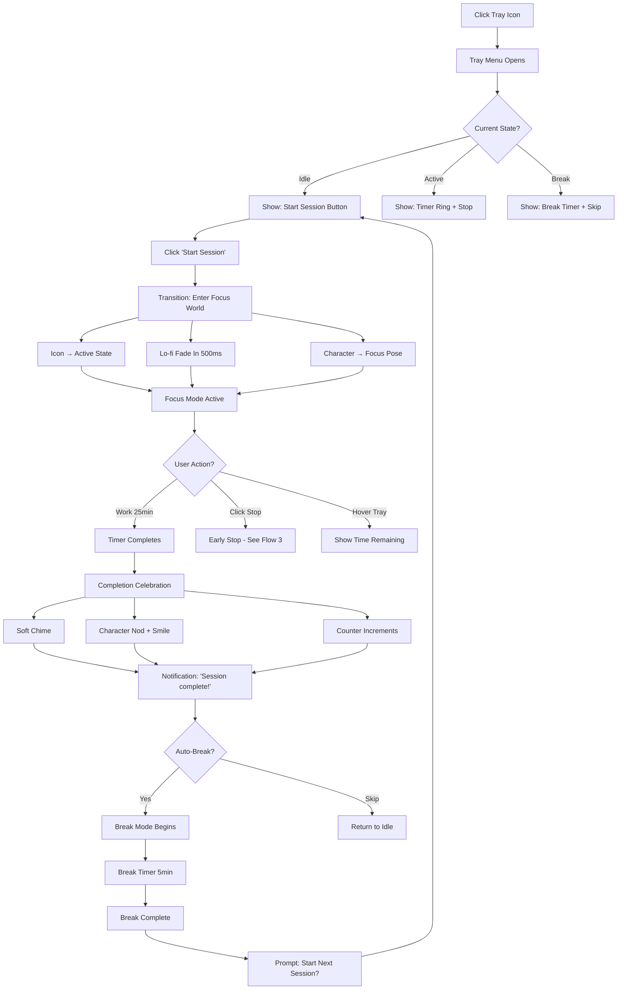
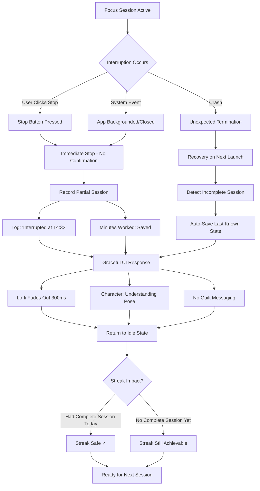
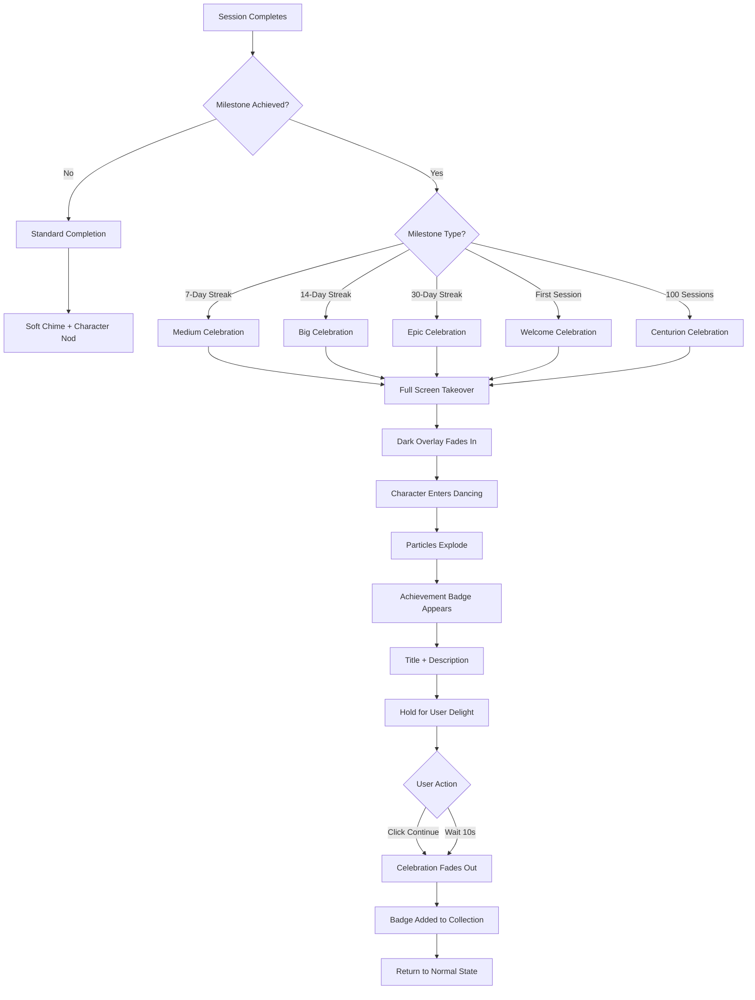
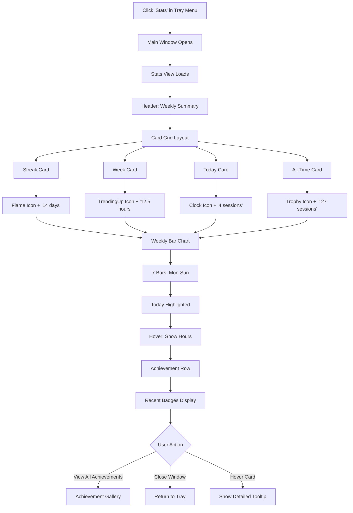

# UX Design Specification test-bmad

**Author:** Master
**Date:** 2026-01-29

---

## Executive Summary

### Project Vision

A cozy, developer-focused Pomodoro desktop application that combines serious focus enforcement with delightful minimal aesthetics. The app lives in the system tray (macOS/Linux), providing always-accessible focus sessions while respecting the developer's workflow. Local-first, file-based storage (Obsidian-style) ensures data ownership and offline functionality.

The UX goal: make productivity feel like a warm companion, not a corporate obligation.

### Target Users

**Alex - The Tech Lead**
- Senior developer working remotely with a mix of deep coding, meetings, and async communication
- Struggles with micro-distraction moments that spiral into lost time
- Needs objective proof of deep work hours for personal accountability
- Values tools that respect their time and intelligence
- Success: Weekly review showing 18+ hours of real deep work, guilt-free weekends

**Sam - The Junior Developer**
- 1-2 years experience, building professional discipline
- High distractibility, imposter syndrome triggers procrastination cycles
- Needs visible progress and gamification to build habits
- Responds to achievements and streaks as motivation
- Success: Growing streak counter, unlocked badges, tangible evidence of growth

### Key Design Challenges

1. **Menu Bar Economy**: System tray apps have limited interaction space. Core actions (start/stop session, view progress) must be accessible in 1-2 clicks without overwhelming the tray menu.

2. **Cozy Professional Balance**: The cute aesthetic (cats, bears, warm colors) must appeal to senior developers without feeling childish. Aim for Slack's playful-but-professional tone, not a children's game.

3. **Non-Intrusive Gamification**: Streaks and achievements should motivate without nagging. Celebrate wins subtly; never guilt-trip for missed days.

4. **Graceful Interruption Handling**: Production incidents happen. The UX must handle abandoned sessions without breaking streaks or inducing guilt - life > app.

### Design Opportunities

1. **Emotional Micro-Moments**: Character animations at key moments (session start, completion, milestone) can create genuine delight and differentiate from sterile competitors.

2. **The Proof Moment**: Stats views that show tangible deep work hours create the "aha!" moment for both personas - objective evidence that replaces guilt with pride.

3. **Cozy First Impression**: Onboarding sets the tone. A friendly character introduction immediately signals "this is different" from corporate productivity tools.

4. **Dark Theme Excellence**: Since dark mode is the default, there's opportunity to craft an exceptionally polished dark UI with warm accents that feels premium.

## Core User Experience

### Defining Experience

The core experience is **tray-first**: the menu bar icon IS the primary interface. Users interact with the app through the system tray for all daily actions. The main window exists only for deep dives into statistics and achievements.

**The Core Loop:**
1. Click tray icon → menu appears
2. Click "Start Session" → timer begins immediately (no confirmation)
3. Work for 25 minutes → icon shows active state with countdown
4. Session ends → notification + character celebration
5. Glance at tray menu → see updated session count and streak
6. Repeat

This loop should feel automatic after day one. Zero friction, zero thought required.

### Platform Strategy

| Aspect           | Decision                          | Rationale                               |
| ---------------- | --------------------------------- | --------------------------------------- |
| **Primary Platform** | macOS menu bar, Linux system tray | Developer-focused, where devs work      |
| **Input Method**     | Mouse/keyboard                    | Desktop-native interaction              |
| **Network**          | 100% offline                      | Local-first philosophy, no dependencies |
| **Performance**      | < 200MB memory, < 3s startup      | Runs all day without impact             |
| **Data**             | Local `.md` files                   | User owns data, git-friendly            |

### Effortless Interactions

**Tray Icon States:**
- **Idle**: Default cozy icon (character at rest)
- **Active Session**: Animated/distinct icon with countdown visible in icon or tooltip
- **Break Time**: Distinct break state indicator
- **Milestone**: Brief celebration state on achievements

**Tray Menu - Complete at a Glance:**
- Start/Stop Session (primary, top of menu)
- Current streak: "Day 12"
- Today's sessions: "4 completed"
- Quick stats: "2h 15m focus today"
- Separator
- Open Stats & History
- Open Achievements
- Settings
- Quit

**What Requires ZERO Clicks:**
- See if session is active (icon state)
- See remaining time (icon/tooltip)

**What Requires ONE Click:**
- Start a session
- Stop a session
- See today's progress (tray menu)

**What Requires TWO Clicks:**
- Open detailed stats window
- Open achievements gallery

### Critical Success Moments

1. **First Session Complete**: Character celebrates, session count shows "1". User thinks "that was pleasant."

2. **First Streak Milestone (Day 7)**: Notification with achievement unlocked. User feels accomplishment without being nagged.

3. **Weekly Review Moment**: User opens stats, sees "18 hours of deep work this week." Objective proof replaces vague guilt.

4. **Interruption Recovery**: User stops mid-session for emergency. App records partial session gracefully, streak intact. User thinks "this app gets real life."

5. **Morning Ritual**: App launches, familiar icon appears, one click starts the day. Zero friction = habit formed.

### Experience Principles

1. **Tray-First**: The menu bar is the primary interface. If it requires opening a window, it's not a core action.

2. **One-Click Core Actions**: Start session, stop session, view progress - all achievable in a single click from the tray menu.

3. **Glanceable Status**: Current state (active timer, streak count, sessions today) visible without any interaction beyond looking at the icon or hovering.

4. **Window = Deep Dive Only**: Main window exists for statistics exploration and achievement gallery - never required for daily workflow.

5. **Silent Until Needed**: App stays invisible until session boundaries or milestones. No nagging, no guilt-tripping, no "you haven't started today" popups.

6. **Graceful Reality**: Interrupted sessions are recorded honestly. Streaks survive real life. The app adapts to users, not the other way around.

## Desired Emotional Response

### Primary Emotional Goals

**Core Feeling: "Cozy productivity companion with earned celebrations"**

The app should feel like a warm, supportive presence that helps without hovering. During work: quiet support. At milestones: genuine celebration. The emotional contrast between daily subtlety and milestone explosiveness creates meaningful dopamine hits that feel earned, not cheap.

**Target Emotional States:**
- **Welcomed** - From first launch, users feel this app was made for them
- **Supported** - During focus, the app is present but not intrusive
- **Proud** - Completions and stats create genuine sense of accomplishment  
- **Delighted** - Milestone moments create real joy, not just notifications
- **Understood** - When life interrupts, the app adapts without judgment

### Emotional Journey Mapping

| Stage            | User Feeling            | Design Driver                                                                   |
| ---------------- | ----------------------- | ------------------------------------------------------------------------------- |
| **First Launch**     | Welcomed, charmed       | Character greets by name, warm colors, cozy onboarding                          |
| **Character Select** | Personal ownership      | "This is MY companion" - choosing from Cat, Cow, Polar Bear, Koala, or Platypus |
| **Session Start**    | Calm, ready             | One click, lo-fi ambient fades in, character settles into focus pose            |
| **Mid-Session**      | Quietly supported       | Ambient sounds, character present but not distracting                           |
| **Session Complete** | Gentle satisfaction     | Soft chime, character nod, counter increments                                   |
| **Break Time**       | Permission to rest      | Character stretches, different ambient tone, guilt-free pause                   |
| **Milestone Unlock** | DELIGHT + pride         | Full-screen celebration, character dance, achievement fanfare                   |
| **Stats Review**     | Validated, accomplished | Numbers that feel like trophies, proof of real work                             |
| **Interruption**     | Understood              | Graceful exit, no guilt messaging, streak protected                             |
| **Return Next Day**  | Familiar comfort        | Same companion waiting, streak continues, ritual resumed                        |

### Micro-Emotions

**Emotions to Cultivate:**
- **Confidence** - "I know exactly how this works"
- **Delight** - "That made me smile"
- **Pride** - "Look what I accomplished"
- **Warmth** - "This feels cozy, not corporate"
- **Accomplishment** - "I'm building something (a habit)"
- **Belonging** - "This is my ritual now"

**Emotions to Prevent:**
- **Guilt** - Never "you haven't started today" messaging
- **Pressure** - Never aggressive streak warnings or countdown anxiety
- **Anxiety** - Never uncertain what will happen next
- **Coldness** - Never sterile or impersonal interactions
- **Judgment** - Never make users feel bad for interruptions or missed days

### Design Implications

**Character System → Personal Connection**
- 5 choosable companions: Cat, Cow, Polar Bear, Koala, Platypus
- Each with encouraging, cheerful personality
- Distinct idle, focus, celebration, and break animations
- Character choice persists and creates "my companion" ownership

**Celebration Contrast → Earned Dopamine**
- Daily session completions: Subtle (character nod, soft chime)
- Streak milestones (7, 14, 30 days): BIG full-screen celebrations with character dance
- Achievement unlocks: Full-screen moment with fanfare
- The quiet-to-explosive contrast makes milestones feel genuinely earned

**Sound Design → Ambient Companion**
- Lo-fi ambient audio during focus sessions (toggleable)
- Gentle chimes at session boundaries
- Celebratory sounds for achievements and milestones
- All audio respects system volume and can be fully muted
- Sound reinforces cozy atmosphere without demanding attention

**Graceful Interruption → Trust Building**
- Stop button always available, no confirmation dialogs
- Partial sessions recorded honestly (no guilt)
- Streak logic forgives real life (one session per day maintains streak)
- No "are you sure?" when stopping - trust the user

### Emotional Design Principles

1. **Quiet Daily, Explosive Milestones**: Reserve big celebrations for earned moments. Daily work gets subtle acknowledgment; milestones get the party.

2. **Character as Companion**: The chosen animal isn't decoration - it's an encouraging presence that users develop affection for over time.

3. **Sound Reinforces Mood**: Lo-fi ambient creates focus atmosphere; celebratory sounds mark achievements. Audio is emotional, not functional.

4. **Never Guilt, Always Support**: The app never makes users feel bad. Missed days, stopped sessions, broken streaks - all handled with grace.

5. **Personalization Creates Ownership**: Character choice and customization make users feel "this is MY app" from the first session.

6. **Trust Through Consistency**: Same character, same sounds, same interactions every day. Ritual familiarity builds emotional comfort.

## UX Pattern Analysis & Inspiration

### Inspiring Products Analysis

| Product             | Core UX Strength                                                  | Key Lesson for test-bmad                                                                |
| ------------------- | ----------------------------------------------------------------- | --------------------------------------------------------------------------------------- |
| **Concentration (iOS)** | Rounded, soft UI with calming colors and minimal friction         | Timer UI should feel soft and calming, not urgent. Rounded corners + muted tones = cozy |
| **Obsidian**            | Local-first file-based storage that feels polished and premium    | Prove that `.md` files can feel premium. Complex power, simple surface                    |
| **Lo-fi Girl**          | Ambient companion presence; audio that triggers focus state       | Character as ambient presence (not interactive toy). Lo-fi audio = focus ritual trigger |
| **Tamagotchi**          | Emotional bond through simple daily care loop                     | Users develop real affection for digital companions. Daily ritual = relationship        |
| **Forest**              | Gamification through visual growth metaphor; stakes without guilt | Progress visualization (growing = completing). Motivation without punishment            |

### Transferable UX Patterns

**Visual Patterns:**
- **Rounded Everything**: Corners, buttons, icons, containers - all softened. Sharp edges feel corporate; rounded feels cozy.
- **Soft Color Palette**: Muted, warm tones. No harsh contrasts. Colors that lower heart rate.
- **Generous Spacing**: Breathing room in layouts. Dense = stressful; spacious = calm.

**Interaction Patterns:**
- **Ambient Companion (Lo-fi Girl model)**: Character is present but doesn't demand interaction. Background presence, not foreground distraction.
- **Visual Progress Metaphor (Forest model)**: Sessions accumulate into something visible - not just numbers, but a growing collection or visual representation.
- **Invisible Complexity (Obsidian model)**: Power features exist but stay hidden. Simple by default, powerful when needed.

**Emotional Patterns:**
- **Bond Through Ritual (Tamagotchi model)**: Daily interaction builds affection. The companion "remembers" you, welcomes you back.
- **Calm UI (Concentration model)**: Every design choice should lower tension, not raise it. Soft sounds, gentle transitions, no urgency.
- **Stakes Without Guilt (Forest model)**: Progress feels meaningful, but failure doesn't punish. Streaks encourage, never shame.

### Anti-Patterns to Avoid

| Anti-Pattern                  | Why It Fails                                     | Our Alternative                                             |
| ----------------------------- | ------------------------------------------------ | ----------------------------------------------------------- |
| **Sharp corners, harsh borders**  | Creates visual tension, feels corporate          | Rounded corners everywhere, soft shadows                    |
| **Aggressive countdown displays** | Induces anxiety, defeats focus purpose           | Gentle time display, progress-focused not countdown-focused |
| **Guilt-based gamification**      | "Your streak died!" creates negative association | Graceful streak logic, no death messaging                   |
| **Overly interactive mascots**    | Distracts from focus, becomes annoying           | Ambient companion that responds, doesn't demand             |
| **Exposed file management**       | Technical friction breaks cozy immersion         | Files invisible by default (Obsidian approach)              |
| **Notification spam**             | Erodes trust, users disable notifications        | Minimal notifications, only at session boundaries           |

### Design Inspiration Strategy

**Adopt Directly:**
- Rounded corner language from Concentration
- Ambient companion presence from Lo-fi Girl
- Lo-fi audio as focus state trigger
- Local-first invisible file storage from Obsidian

**Adapt for Our Context:**
- Forest's growth metaphor → adapt to session/streak visualization (not trees, but character progress or collection)
- Tamagotchi's care loop → simplify to daily session ritual (no feeding/cleaning, just working together)
- Concentration's timer UI → adapt for tray menu context (even more minimal)

**Explicitly Avoid:**
- Any guilt or death language around streaks/sessions
- Sharp, corporate visual language
- Demanding or attention-seeking mascot behavior
- Visible file paths or technical storage UI
- Countdown anxiety (prefer progress framing)

**Unique Positioning:**
Combine Lo-fi Girl's ambient calm + Tamagotchi's companion bond + Forest's meaningful progress + Obsidian's invisible power + Concentration's soft visuals = A focus companion that feels like a cozy ritual, not a productivity tool.

## Design System Foundation

### Design System Choice

**Stack:** shadcn/ui + Tailwind CSS + Radix UI primitives on Electron

This combination provides:
- Full visual customization for unique cozy aesthetic
- Accessible, production-ready component primitives
- Utility-first styling for rapid iteration
- Copy-paste ownership (no vendor lock-in)
- Cross-platform desktop support via Electron

### Rationale for Selection

| Requirement           | How This Stack Delivers                                          |
| --------------------- | ---------------------------------------------------------------- |
| **Unique cozy aesthetic** | shadcn has no opinionated styling - full customization freedom   |
| **Rounded, soft UI**      | Tailwind utilities (rounded-2xl, shadow-soft) apply consistently |
| **Solo developer**        | Copy-paste components, no complex abstractions                   |
| **MVP speed**             | Pre-built accessible components, customize only visuals          |
| **Accessibility**         | Radix primitives handle a11y automatically                       |
| **Long-term ownership**   | You own the component code, no dependency on library updates     |

### Implementation Approach

**Phase 1: Foundation Setup**
- Initialize Tailwind with custom theme configuration
- Install shadcn/ui CLI and initialize project
- Define custom color palette (warm, cozy tones)
- Set global border-radius to rounded (2xl default)
- Configure custom shadows (soft, diffused)

**Phase 2: Core Components**
- Adapt shadcn Button → cozy rounded button with hover warmth
- Adapt shadcn DropdownMenu → tray menu styling
- Adapt shadcn Dialog → achievement celebration modals
- Adapt shadcn Progress → session timer display
- Create custom CharacterDisplay component

**Phase 3: Custom Components**
- TrayMenu (native Electron + styled dropdown)
- TimerRing (circular progress with character)
- AchievementCard (celebration modal content)
- StatsChart (weekly/daily visualization)
- CharacterSprite (animated companion states)

### Customization Strategy

**Theme Tokens (Tailwind config):**

| Token Category | Default shadcn     | Cozy Customization                      |
| -------------- | ------------------ | --------------------------------------- |
| **Border Radius**  | rounded-md         | rounded-2xl (16px) as base              |
| **Colors**         | Slate/Zinc grays   | Warm browns, cream, muted orange/coral  |
| **Shadows**        | Sharp drop shadows | Soft, diffused, warm-tinted shadows     |
| **Spacing**        | Compact            | Generous (more padding, breathing room) |
| **Typography**     | System fonts       | Rounded sans-serif (Inter, Nunito)      |
| **Transitions**    | 150ms ease         | 200-300ms ease-out (gentler motion)     |

**Component Customization Pattern:**
1. Copy shadcn component to project
2. Replace color classes with cozy palette tokens
3. Increase border-radius to rounded-2xl
4. Add softer shadows and gentler transitions
5. Test with character sprites and lo-fi aesthetic

**Design Tokens Preview:**
```css
/* Cozy color palette direction */
--cozy-bg: warm cream/off-white (dark: deep brown)
--cozy-surface: soft beige (dark: warm charcoal)
--cozy-accent: muted coral/peach
--cozy-text: warm brown (dark: cream)
--cozy-success: soft sage green
--cozy-border: warm tan with low opacity
```

## Defining Experience

### The Core Moment

**"Start a session and enter a cozy focus world with your companion"**

The defining experience isn't starting a timer - it's entering a state. When users click "Start Session," they're not just beginning a 25-minute countdown; they're stepping into a cozy focus bubble with their chosen companion by their side.

**What users will tell friends:**
> "I have this little koala that works with me. When I start a session, lo-fi music comes on and he gets into his focus pose. It's weirdly motivating."

This positions test-bmad closer to Lo-fi Girl than to traditional Pomodoro apps. The timer is infrastructure; the *feeling* is the product.

### User Mental Model

**How users think about it:**
- NOT: "I'm starting a 25-minute productivity timer"
- YES: "I'm sitting down to work with my buddy"

**Mental model shift:**
| Traditional Pomodoro | test-bmad                        |
| -------------------- | -------------------------------- |
| Timer = the product  | Timer = invisible infrastructure |
| Focus on countdown   | Focus on atmosphere              |
| Productivity tool    | Focus companion                  |
| Work obligation      | Cozy ritual                      |

**Expectations users bring:**
- Instant response (no loading, no setup)
- Clear state change (know when "in session")
- Non-intrusive presence (companion there but not demanding)
- Guilt-free exit (can stop anytime without punishment)

### Success Criteria

| Criteria             | Definition                                  | Measurement                                              |
| -------------------- | ------------------------------------------- | -------------------------------------------------------- |
| **Instant immersion**    | One click → immediately feels "in the zone" | < 500ms to lo-fi audio + character animation start       |
| **Cozy atmosphere**      | Experience feels warm, not clinical         | User body language relaxes; qualitative feedback         |
| **Companion presence**   | Character feels like a work buddy           | Users refer to companion by species/name in conversation |
| **Obvious state change** | Clear difference between idle and focus     | Icon, sound, and character all shift together            |
| **Frictionless entry**   | Zero hesitation to start                    | No confirmation dialogs; single click activation         |

### Novel UX Patterns

**What's Established (no education needed):**
- Pomodoro timer concept (25/5 work/break cycles)
- System tray menu interaction
- Desktop notifications
- Streak/gamification mechanics

**What's Novel (our differentiator):**
- **Atmosphere shift**: The transition from "idle" to "focus world" is a designed moment, not just a timer starting
- **Ambient companion**: Character as Lo-fi Girl-style presence, not interactive Tamagotchi pet
- **Integrated lo-fi**: Audio bundled into focus app (usually separate tools)
- **Emotional state design**: Explicitly designing for calm, not productivity anxiety

**No user education required** - all interactions are familiar. The novelty is in how they combine to create atmosphere.

### Experience Mechanics

**Phase 1: Initiation (The Click)**
```
User clicks tray icon
    → Menu appears instantly
    → "Start Session" prominent at top
    → Single click begins session (no confirmation)
```

**Phase 2: Transition (Entering Focus World)**
```
0ms:    Click registered
0-200ms: Tray icon shifts to "active" state
0-500ms: Lo-fi ambient begins fade-in
0-300ms: Character transitions idle → focus pose
500ms:  Optional subtle notification: "Focus time. You got this."
```
The transition should feel like a gentle "whoosh" into focus mode - quick but not jarring.

**Phase 3: Focus State (Working Together)**
```
Ongoing:
- Lo-fi plays continuously (volume respects system settings)
- Character in calm focus pose
- Subtle idle animations (breathing, occasional blink) - alive but not distracting
- Timer visible on icon hover/tooltip
- Character is PRESENT but not DEMANDING attention
```

**Phase 4: Completion (Gentle Exit)**
```
Timer reaches 0:
- Soft chime (distinct from harsh alarm)
- Character does small celebration (smile, stretch, nod)
- Lo-fi fades out OR shifts to "break" ambient
- Notification: "Session complete! 4 today. Break time?"
- Tray menu updates with new count
```

**Phase 5: Break State (Optional)**
```
If user starts break:
- Different ambient tone (lighter, more playful)
- Character in relaxed pose (stretching, coffee)
- Break timer in tooltip
- After break: gentle prompt to start next session (not aggressive)
```

### Atmosphere Design

The "cozy focus world" is created through synchronized elements:

| Element        | Idle State        | Focus State            | Break State        |
| -------------- | ----------------- | ---------------------- | ------------------ |
| **Lo-fi audio**    | Silent            | Focused beats, calm    | Lighter, playful   |
| **Character pose** | Relaxed, waving   | Working, concentrated  | Stretching, coffee |
| **Tray icon**      | Default character | Active indicator       | Break indicator    |
| **Color mood**     | Neutral warm      | Slightly deeper warmth | Brighter warmth    |

All elements shift together to create unmistakable state change.

## Visual Design Foundation

### Color System

**Philosophy:** Warm, cozy, coffee-shop inspired palette that feels inviting in dark mode while remaining professional enough for senior developers.

**Dark Mode (Primary):**

| Role             | Hex     | Tailwind Token     | Usage                              |
| ---------------- | ------- | ------------------ | ---------------------------------- |
| **Background**       | `#1C1816` | `bg-cozy-bg`         | App canvas, main background        |
| **Surface**          | `#2A2422` | `bg-cozy-surface`    | Cards, menus, tray dropdown        |
| **Surface Elevated** | `#3D3533` | `bg-cozy-elevated`   | Hover states, popups, modals       |
| **Primary Accent**   | `#E8A598` | `text-cozy-accent`   | Buttons, focus rings, highlights   |
| **Secondary Accent** | `#A8C5A0` | `text-cozy-success`  | Success states, completion         |
| **Text Primary**     | `#F5F0E8` | `text-cozy-text`     | Main readable text                 |
| **Text Muted**       | `#A89888` | `text-cozy-muted`    | Secondary text, labels, timestamps |
| **Border**           | `#4A4240` | `border-cozy-border` | Subtle separators, outlines        |

**Light Mode (Future):**

| Role             | Hex     | Usage                    |
| ---------------- | ------- | ------------------------ |
| **Background**       | `#FAF7F2` | Warm cream canvas        |
| **Surface**          | `#F5F0E8` | Soft beige containers    |
| **Surface Elevated** | `#FFFFFF` | White popups             |
| **Primary Accent**   | `#E8A598` | Consistent coral accent  |
| **Secondary Accent** | `#A8C5A0` | Consistent sage success  |
| **Text Primary**     | `#3D3028` | Warm brown text          |
| **Text Muted**       | `#8B7355` | Medium brown secondaries |
| **Border**           | `#E5DDD0` | Tan separators           |

**Character Accent Colors:**

| Character  | Accent Color | Hex     | Usage                           |
| ---------- | ------------ | ------- | ------------------------------- |
| **Cat**        | Peachy Coral | `#F4B8A8` | Cat-specific badges, highlights |
| **Cow**        | Cream Spots  | `#F5E6D3` | Cow-specific badges             |
| **Polar Bear** | Icy Blue     | `#B8D4E3` | Bear-specific badges            |
| **Koala**      | Eucalyptus   | `#A8C5A0` | Koala-specific badges           |
| **Platypus**   | Teal Brown   | `#7BAFA3` | Platypus-specific badges        |

**Semantic Colors:**

| Semantic Role | Color              | Usage                               |
| ------------- | ------------------ | ----------------------------------- |
| **Success**       | Sage `#A8C5A0`       | Session complete, streak maintained |
| **Warning**       | Amber `#E8C598`      | Break ending soon, gentle alerts    |
| **Error**         | Soft red `#D9A5A5`   | Never harsh - graceful error states |
| **Info**          | Muted blue `#A5B8C5` | Tooltips, helpful hints             |

### Typography System

**Font Stack:**

| Role      | Font Family    | Fallback              | Purpose                          |
| --------- | -------------- | --------------------- | -------------------------------- |
| **Headings**  | Nunito         | system-ui, sans-serif | Warm, rounded, friendly          |
| **Body/UI**   | Inter          | system-ui, sans-serif | Clean, readable, professional    |
| **Monospace** | JetBrains Mono | monospace             | Code snippets, technical display |

**Type Scale:**

| Element    | Font   | Size | Weight | Line Height | Usage                    |
| ---------- | ------ | ---- | ------ | ----------- | ------------------------ |
| **Display**    | Nunito | 32px | 700    | 1.2         | Achievement celebrations |
| **H1**         | Nunito | 24px | 700    | 1.3         | Window titles            |
| **H2**         | Nunito | 20px | 600    | 1.3         | Section headers          |
| **H3**         | Nunito | 16px | 600    | 1.4         | Card titles              |
| **Body**       | Inter  | 14px | 400    | 1.5         | Main content             |
| **Body Small** | Inter  | 13px | 400    | 1.5         | Tray menu items          |
| **Caption**    | Inter  | 12px | 500    | 1.4         | Labels, timestamps       |
| **Tiny**       | Inter  | 11px | 500    | 1.3         | Badges, counters         |

**Typography Principles:**
- Nunito for personality (headings, celebrations, character names)
- Inter for utility (menus, stats, body text)
- Never use thin weights (maintain warmth)
- Generous line-height for calm readability

### Spacing & Layout Foundation

**Spacing Scale (8px base):**

| Token | Value | CSS Variable | Usage                      |
| ----- | ----- | ------------ | -------------------------- |
| `0`     | 0px   | `--spacing-0`  | Reset                      |
| `1`     | 4px   | `--spacing-1`  | Tight gaps, icon padding   |
| `2`     | 8px   | `--spacing-2`  | Related element spacing    |
| `3`     | 12px  | `--spacing-3`  | Component internal padding |
| `4`     | 16px  | `--spacing-4`  | Standard padding           |
| `5`     | 20px  | `--spacing-5`  | Card padding               |
| `6`     | 24px  | `--spacing-6`  | Section spacing            |
| `8`     | 32px  | `--spacing-8`  | Major section breaks       |
| `10`    | 40px  | `--spacing-10` | Window padding             |
| `12`    | 48px  | `--spacing-12` | Celebration modal spacing  |

**Border Radius Scale:**

| Token | Value  | Usage                                |
| ----- | ------ | ------------------------------------ |
| `sm`    | 6px    | Small buttons, badges                |
| `md`    | 8px    | Input fields                         |
| `lg`    | 12px   | Cards, containers                    |
| `xl`    | 16px   | Modals, large cards (DEFAULT)        |
| `2xl`   | 24px   | Celebration modals, character frames |
| `full`  | 9999px | Circular elements, avatars           |

**Layout Principles:**

1. **Generous Padding**: Never cramped. Minimum 16px padding on containers.
2. **Breathing Room**: 24px+ between unrelated sections.
3. **Tray Menu Density**: Compact but readable - 8px vertical spacing between items.
4. **Main Window Spaciousness**: 32-48px margins, feels calm and premium.
5. **Rounded Everywhere**: Default to `rounded-xl` (16px) for all containers.

**Shadow System:**

| Token         | Value                           | Usage                   |
| ------------- | ------------------------------- | ----------------------- |
| `shadow-soft`   | `0 2px 8px rgba(0,0,0,0.08)`      | Subtle elevation        |
| `shadow-medium` | `0 4px 16px rgba(0,0,0,0.12)`     | Cards, dropdowns        |
| `shadow-glow`   | `0 0 20px rgba(232,165,152,0.15)` | Accent glow on focus    |
| `shadow-warm`   | `0 4px 20px rgba(28,24,22,0.25)`  | Dark mode modal shadows |

### Accessibility Considerations

**Contrast Ratios (WCAG AA Compliance):**

| Combination                | Ratio  | Pass | Notes                 |
| -------------------------- | ------ | ---- | --------------------- |
| Text Primary on Background | 12.5:1 | ✅   | Excellent readability |
| Text Muted on Background   | 5.2:1  | ✅   | Above 4.5:1 minimum   |
| Accent on Background       | 6.8:1  | ✅   | Good for interactive  |
| Text Primary on Surface    | 10.2:1 | ✅   | Cards remain readable |

**Accessibility Principles:**

1. **Focus Indicators**: Visible focus rings using accent color glow
2. **Touch Targets**: Minimum 44px for clickable areas (tray menu items)
3. **Motion**: Respect `prefers-reduced-motion` - disable character animations
4. **Color Independence**: Never use color alone to convey meaning
5. **Screen Reader**: All interactive elements properly labeled

**Font Size Accessibility:**
- Minimum body text: 14px
- Never below 11px for any text
- Respect system font size preferences where possible

## Design Direction Decision

### Design Directions Explored

**Tray Menu Variations:**
1. Minimal Compact - Clean developer-focused list
2. Character Focused - Companion greeting in header
3. Timer Centric - Circular progress as hero element ✅ **SELECTED**

**Main Window Variations:**
4. Dashboard Style - Traditional tabs with charts (bar chart adopted)
5. Card-Based - Modular card layout ✅ **SELECTED**
6. Minimal Focus - Single hero number

**Celebration Variations:**
7. Full Screen - Maximum delight takeover ✅ **SELECTED**
8. Badge Focus - Achievement as modal

### Chosen Direction

**Tray Menu: Timer Centric**
- Circular progress ring showing session progress
- Timer countdown as the visual hero
- Quick stats (streak, today, focus time) below
- Start/Stop button prominent
- Character integrated into timer ring center (optional)

**Main Window: Card-Based + Bar Chart**
- Modular card layout for stats (streak, week, today, all-time)
- Icons instead of emoji for cleaner professional feel
- Weekly bar chart showing daily focus hours (adopted from Dashboard style)
- Achievement cards with icon-based badges
- Flexible grid that breathes

**Celebrations: Full Screen Takeover**
- Full window celebration for milestones
- Character dancing animation
- Particle effects (confetti, sparkles)
- Achievement title and description
- Dismiss to continue (not auto-dismiss)

### Design Rationale

| Decision                 | Why                                                                                |
| ------------------------ | ---------------------------------------------------------------------------------- |
| **Timer Centric Tray**       | Timer is infrastructure but the ring makes it cozy, not clinical. Visual progress. |
| **Card-Based Window**        | Modular = flexible. Cards feel collectible, match achievement vibe.                |
| **Icons over Emoji**         | More professional for senior devs. Cleaner visual language. Still warm with color. |
| **Bar Chart Addition**       | Visual proof of weekly progress. The "aha" moment in chart form.                   |
| **Full Screen Celebrations** | Matches "big earned moments" emotional goal. Maximum contrast from quiet daily.    |

### Implementation Approach

**Tray Menu Components:**
```
TrayMenu/
├── TimerRing          - Circular SVG progress with cozy colors
├── TimerDisplay       - Time remaining, centered in ring
├── QuickStats         - Streak, today, focus time row
├── ActionButton       - Start/Stop/Pause primary button
└── MenuItems          - Stats, Achievements, Settings, Quit
```

**Main Window Components:**
```
MainWindow/
├── Header             - App title, navigation tabs (icons)
├── StatsGrid/
│   ├── StreakCard     - Current streak with icon
│   ├── WeekCard       - Weekly hours with trend
│   ├── TodayCard      - Sessions today
│   └── TotalCard      - All-time sessions
├── WeeklyChart        - Bar chart, 7 days, highlight today
└── AchievementRow     - Recent badges with icons
```

**Celebration Components:**
```
Celebration/
├── Overlay            - Full screen dark overlay
├── CharacterSprite    - Dancing/celebrating animation
├── ParticleSystem     - Confetti/sparkle effects
├── AchievementBadge   - Large icon badge
├── Title              - Achievement name
├── Description        - What they earned
└── DismissButton      - "Continue" to close
```

**Icon System:**
- Library: Lucide Icons (clean, consistent, MIT license)
- Style: 24px stroke icons, 1.5px stroke weight
- Colors: Use cozy-accent for active, cozy-muted for inactive

| Context      | Icon Examples              |
| ------------ | -------------------------- |
| **Streak**       | `flame` or `zap`               |
| **Sessions**     | `clock` or `timer`             |
| **Focus Time**   | `coffee` or `target`           |
| **Achievements** | `trophy`, `star`, `award`, `medal` |
| **Stats**        | `bar-chart-2` or `trending-up` |
| **Settings**     | `settings` or `sliders`        |
| **Play/Pause**   | `play`, `pause`, `stop`          |

### Visual Specifications

**Timer Ring (Tray Menu):**
- Size: 120px diameter
- Stroke width: 8px
- Progress color: cozy-accent (#E8A598)
- Track color: cozy-border (#4A4240)
- Animation: Smooth progress, 1s transition

**Cards (Main Window):**
- Border radius: 16px (rounded-xl)
- Padding: 20px
- Background: cozy-surface (#2A2422)
- Hover: Subtle lift (translateY -2px)
- Icon size: 20px, cozy-muted color

**Bar Chart:**
- 7 bars (Mon-Sun)
- Bar radius: 6px top corners
- Active bar: cozy-accent
- Other bars: cozy-accent at 50% opacity
- Height reflects hours (proportional)

**Celebration Overlay:**
- Background: cozy-bg at 95% opacity
- Character: 80-120px sprite, bouncing animation
- Particles: 20-30 elements, fade out over 3s
- Badge: 100px, glowing shadow effect

## User Journey Flows

### Flow 1: First Launch & Onboarding

**Goal:** Transform first-time users into engaged companion owners within 60 seconds.



**Key Design Decisions:**
- Character selection is THE onboarding moment (creates ownership)
- Tutorial is 3 steps max (respect developer intelligence)
- Immediate session start option (don't block eager users)
- No account creation, no email, no friction

**States & Transitions:**

| State     | Visual               | Character        | Audio        |
| --------- | -------------------- | ---------------- | ------------ |
| Welcome   | Full window, warm bg | Waving           | Gentle chime |
| Selection | Character cards      | Preview poses    | None         |
| Tutorial  | Overlay tooltips     | Demonstrating    | Soft clicks  |
| Ready     | Tray minimized       | Settled, waiting | None         |

### Flow 2: Daily Focus Session (Core Loop)

**Goal:** One click to focus world. Zero friction daily ritual.



**Tray Menu States:**

| State     | Timer Ring    | Primary Button  | Quick Stats           |
| --------- | ------------- | --------------- | --------------------- |
| **Idle**  | Empty/hidden  | "Start Session" | Streak, Today's count |
| **Focus** | Filling coral | "Stop"          | Time remaining        |
| **Break** | Filling sage  | "Skip Break"    | Break time left       |

**Timing Specifications:**
- Menu open: instant (<50ms)
- Session start transition: 500ms total
- Lo-fi fade: 0-500ms ease-in
- Character pose change: 300ms ease-out
- Completion celebration: 2 seconds

### Flow 3: Session Interruption (Graceful Exit)

**Goal:** Life happens. Never guilt. Always honest data.



**Anti-Guilt Design:**
- NO "Are you sure?" dialogs
- NO "You're abandoning your session!" warnings
- NO streak death notifications
- Character shows understanding, not disappointment

**Data Recording Example:**
```markdown
## 2026-01-29

### Sessions
- 09:15 - 09:40 ✓ Complete (25m)
- 10:02 - 10:16 ○ Interrupted (14m) - "stopped manually"
- 14:30 - 14:55 ✓ Complete (25m)

### Summary
- Complete: 2 sessions (50m)
- Partial: 1 session (14m)
- Total focus: 64m
```

### Flow 4: Milestone Celebration (Earned Delight)

**Goal:** Big moments deserve big celebrations. Contrast from daily subtlety.



**Celebration Tiers:**

| Milestone         | Duration | Particles      | Character Animation | Sound             |
| ----------------- | -------- | -------------- | ------------------- | ----------------- |
| **First Session** | 3s       | Sparkles       | Happy bounce        | Warm chime        |
| **7-Day Streak**  | 4s       | Confetti burst | Victory dance       | Celebratory tune  |
| **14-Day Streak** | 5s       | Confetti rain  | Extended dance      | Fanfare           |
| **30-Day Streak** | 6s       | Fireworks      | Epic celebration    | Full fanfare      |
| **100 Sessions**  | 6s       | Gold confetti  | Special animation   | Achievement sound |

**Badge System:**
- Each milestone unlocks a unique badge
- Badges use character-specific accent colors
- Collection viewable in main window
- Badges are Lucide icons with custom styling

### Flow 5: Stats Review (The Proof Moment)

**Goal:** Transform abstract "productivity" into visible, tangible evidence.



**Stats Card Specifications:**

| Card          | Icon          | Primary Value  | Secondary           | Color        |
| ------------- | ------------- | -------------- | ------------------- | ------------ |
| **Streak**    | `flame`       | "14 days"      | "Best: 21 days"     | Accent coral |
| **This Week** | `trending-up` | "12.5 hours"   | "+2.5 vs last week" | Success sage |
| **Today**     | `clock`       | "4 sessions"   | "1h 40m focus"      | Muted text   |
| **All-Time**  | `trophy`      | "127 sessions" | "Since Jan 15"      | Gold accent  |

**Weekly Bar Chart:**
- 7 bars representing Mon-Sun
- Height proportional to hours
- Today's bar: full coral accent
- Other days: coral at 60% opacity
- Hover reveals exact hours + session count
- Empty days show minimal stub (not zero height)

**The "Aha" Moment:**
> Alex opens stats on Friday. The bar chart shows consistent 2-3 hour bars across the week. Total: 18 hours. This is the proof moment - objective evidence that replaces vague guilt with concrete accomplishment.

### Journey Patterns

Across all flows, these patterns emerge:

**Navigation Patterns:**
- Tray menu as primary hub for all actions
- Main window for deep dives only
- One-click return to tray from any window

**Decision Patterns:**
- Binary choices only (Start/Stop, Yes/Later)
- No multi-step wizards after onboarding
- Defaults always safe (don't break streaks)

**Feedback Patterns:**
- State changes are immediate + visible
- Audio reinforces visual (optional)
- Character reactions confirm user actions

**Recovery Patterns:**
- Graceful degradation on interruption
- Auto-save on any exit
- No data loss scenarios

### Flow Optimization Principles

1. **Minimize Steps to Value**
   - First session possible in 3 clicks from install
   - Daily loop is exactly 1 click

2. **Reduce Cognitive Load**
   - Never more than 2 choices at once
   - Current state always visible in tray icon

3. **Clear Progress Indicators**
   - Timer ring fills visually
   - Session counter increments visibly
   - Streak number prominent

4. **Moments of Delight**
   - Character animations at every state change
   - Celebrations scaled to achievement significance
   - Weekly stats as "proof moment"

5. **Graceful Error Handling**
   - No error dialogs in normal use
   - Interruptions handled silently
   - Crash recovery automatic

## Component Strategy

### Design System Components

**shadcn/ui components to install and customize:**

| Component      | Customization Needed                                 |
| -------------- | ---------------------------------------------------- |
| `Button`       | Cozy rounded style, coral accent, soft shadows       |
| `Card`         | 16px radius, warm surface color, generous padding    |
| `Dialog`       | Celebration modal styling, dark overlay, 24px radius |
| `DropdownMenu` | Tray menu base, compact item spacing, cozy colors    |
| `Badge`        | Character-colored variants, icon integration         |
| `Tooltip`      | Warm styling, timer remaining display                |
| `Tabs`         | Main window nav, icon-only variant                   |
| `Switch`       | Settings, cozy toggle styling                        |
| `Separator`    | Menu dividers                                        |

**Installation:**
```bash
npx shadcn@latest add button card dialog dropdown-menu badge tooltip tabs switch separator
```

**Gap Analysis - Custom Components Required:**

| Custom Component    | Why Needed                                    |
| ------------------- | --------------------------------------------- |
| `TimerRing`         | Circular SVG progress (shadcn Progress is linear) |
| `CharacterSprite`   | Animated companion with multiple poses        |
| `TrayMenu`          | Native Electron tray + styled dropdown hybrid |
| `ParticleSystem`    | Confetti/sparkle celebration effects          |
| `WeeklyBarChart`    | 7-day focus visualization                     |
| `CharacterSelector` | Onboarding character picker                   |
| `AchievementBadge`  | Icon-based milestone badge                    |
| `CelebrationOverlay`| Full-screen takeover composition              |

### Custom Components

#### TimerRing

**Purpose:** Display session progress as a filling circular ring - the visual hero of the tray menu.

**Anatomy:**
```
┌─────────────────────┐
│    ╭───────────╮    │
│   ╱   12:45    ╲   │  ← Time remaining (center)
│  │   remaining  │  │
│   ╲            ╱   │
│    ╰───────────╯    │  ← Progress ring (fills clockwise)
└─────────────────────┘
```

**States:**

| State        | Ring Color     | Fill % | Center Text |
| ------------ | -------------- | ------ | ----------- |
| **Idle**     | Border only    | 0%     | "Start"     |
| **Focus**    | Coral accent   | 0-100% | "MM:SS"     |
| **Break**    | Sage green     | 0-100% | "MM:SS"     |
| **Complete** | Full coral     | 100%   | "Done!"     |
| **Paused**   | Coral (dimmed) | Frozen | "Paused"    |

**Variants:**
- `size="sm"` (80px) - Compact tray view
- `size="md"` (120px) - Default tray menu
- `size="lg"` (160px) - Main window display

**Props:**
```typescript
interface TimerRingProps {
  progress: number;         // 0-100
  totalSeconds: number;     // Total duration
  remainingSeconds: number; // Time left
  state: 'idle' | 'focus' | 'break' | 'complete' | 'paused';
  size?: 'sm' | 'md' | 'lg';
  showTime?: boolean;       // Display MM:SS in center
}
```

**Accessibility:**
- `role="progressbar"`
- `aria-valuenow`, `aria-valuemin`, `aria-valuemax`
- `aria-label="Focus session progress, 12 minutes remaining"`

---

#### CharacterSprite

**Purpose:** Display the animated companion in various poses and states.

**Poses:**

| Pose           | When Used             | Animation           |
| -------------- | --------------------- | ------------------- |
| **idle**       | No active session     | Gentle breathing    |
| **waving**     | Greeting, onboarding  | Hand wave loop      |
| **focus**      | During focus session  | Working pose, blink |
| **break**      | During break          | Stretching, coffee  |
| **celebrate**  | Session complete      | Small bounce        |
| **dance**      | Milestone celebration | Full dance loop     |
| **understand** | Session interrupted   | Gentle nod          |

**Variants:**
- 5 characters: `cat`, `cow`, `polarBear`, `koala`, `platypus`
- Each character has all pose variants
- Sizes: `sm` (40px), `md` (60px), `lg` (80px), `xl` (120px)

**Props:**
```typescript
interface CharacterSpriteProps {
  character: 'cat' | 'cow' | 'polarBear' | 'koala' | 'platypus';
  pose: 'idle' | 'waving' | 'focus' | 'break' | 'celebrate' | 'dance' | 'understand';
  size?: 'sm' | 'md' | 'lg' | 'xl';
  animated?: boolean;  // Respect prefers-reduced-motion
}
```

**Accessibility:**
- `role="img"`
- `aria-label="Your koala companion is working alongside you"`
- Animations respect `prefers-reduced-motion`

---

#### TrayMenu

**Purpose:** The primary interface - dropdown from system tray with session controls and quick stats.

**Anatomy:**
```
┌─────────────────────────┐
│      ╭─────────╮        │
│     │  12:45  │        │  ← TimerRing
│      ╰─────────╯        │
│                         │
│  🔥 Day 14  •  4 today  │  ← Quick stats row
│  ─────────────────────  │
│  ▶️  Start Session      │  ← Primary action
│  ─────────────────────  │
│  📊  Stats & History    │
│  🏆  Achievements       │
│  ⚙️   Settings          │
│  ─────────────────────  │
│  ✕   Quit               │
└─────────────────────────┘
```

**States:**

| State     | Timer Display   | Primary Button  | Stats Shown         |
| --------- | --------------- | --------------- | ------------------- |
| **Idle**  | Hidden or empty | "Start Session" | Streak, today count |
| **Focus** | Ring filling    | "Stop"          | Time remaining      |
| **Break** | Ring (sage)     | "Skip Break"    | Break time left     |

**Props:**
```typescript
interface TrayMenuProps {
  sessionState: 'idle' | 'focus' | 'break';
  currentStreak: number;
  todaySessions: number;
  remainingSeconds?: number;
  totalSeconds?: number;
  onStartSession: () => void;
  onStopSession: () => void;
  onSkipBreak: () => void;
  onOpenStats: () => void;
  onOpenAchievements: () => void;
  onOpenSettings: () => void;
  onQuit: () => void;
}
```

**Accessibility:**
- Full keyboard navigation (arrow keys, Enter, Escape)
- Focus trap within menu when open
- `aria-expanded` on trigger
- Menu items have `role="menuitem"`

---

#### ParticleSystem

**Purpose:** Visual celebration effects - confetti, sparkles, fireworks for milestone moments.

**Variants:**

| Variant       | Visual                  | Used For      |
| ------------- | ----------------------- | ------------- |
| **sparkles**  | Small stars, float up   | First session |
| **confetti**  | Colored rectangles fall | 7-day streak  |
| **fireworks** | Bursts from center      | 30-day streak |

**Props:**
```typescript
interface ParticleSystemProps {
  variant: 'sparkles' | 'confetti' | 'fireworks';
  intensity?: 'low' | 'medium' | 'high';
  duration?: number;  // ms, default 3000
  colors?: string[];  // Override default palette
  onComplete?: () => void;
}
```

**Accessibility:**
- `aria-hidden="true"` (decorative)
- Disabled when `prefers-reduced-motion`
- No motion = static celebratory glow instead

---

#### WeeklyBarChart

**Purpose:** Visualize 7 days of focus hours as vertical bars - the "proof moment" visualization.

**Anatomy:**
```
     Hours
  4 ┤
    │         ██
  3 ┤    ██   ██        ██
    │    ██   ██   ██   ██
  2 ┤ ██ ██   ██   ██   ██
    │ ██ ██   ██   ██   ██   ██
  1 ┤ ██ ██   ██   ██   ██   ██
    │ ██ ██   ██   ██   ██   ██
  0 └─────────────────────────────
      M   T   W   T   F   S   S
                          ↑ Today (highlighted)
```

**Props:**
```typescript
interface WeeklyBarChartProps {
  data: {
    day: string;      // 'Mon', 'Tue', etc.
    hours: number;
    sessions: number;
    isToday: boolean;
  }[];
  accentColor?: string;
  height?: number;
}
```

**Interaction:**
- Hover bar → tooltip shows "2.5 hours • 6 sessions"
- Today's bar highlighted with full accent color
- Other bars at 60% opacity

**Accessibility:**
- `role="img"` with `aria-label` summarizing data
- Alternative: data table for screen readers

---

#### CharacterSelector

**Purpose:** Onboarding component for choosing your companion - THE ownership moment.

**Anatomy:**
```
┌─────────────────────────────────────┐
│        Choose Your Companion        │
│                                     │
│  ┌─────┐ ┌─────┐ ┌─────┐           │
│  │ 🐱  │ │ 🐮  │ │ 🐻‍❄️ │           │
│  │ Cat │ │ Cow │ │Bear │           │
│  └─────┘ └─────┘ └─────┘           │
│                                     │
│  ┌─────┐ ┌─────┐                   │
│  │ 🐨  │ │ 🦆  │                   │
│  │Koala│ │Platy│                   │
│  └─────┘ └─────┘                   │
│                                     │
│         [ Continue → ]              │
└─────────────────────────────────────┘
```

**Props:**
```typescript
interface CharacterSelectorProps {
  selectedCharacter?: Character;
  onSelect: (character: Character) => void;
  onContinue: () => void;
}
```

**Interaction:**
- Click/keyboard to select
- Selected character shows preview animation
- Character does small wave when hovered

**Accessibility:**
- Radio group semantics
- `aria-checked` on selected
- Focus ring on keyboard navigation

---

#### AchievementBadge

**Purpose:** Display earned milestone badges with icon and character-specific coloring.

**Badge Types:**

| Badge             | Icon      | Color            |
| ----------------- | --------- | ---------------- |
| **First Session** | `star`    | Character accent |
| **7-Day Streak**  | `flame`   | Character accent |
| **14-Day Streak** | `zap`     | Character accent |
| **30-Day Streak** | `crown`   | Gold             |
| **100 Sessions**  | `trophy`  | Gold             |
| **Early Bird**    | `sunrise` | Character accent |
| **Night Owl**     | `moon`    | Character accent |

**Props:**
```typescript
interface AchievementBadgeProps {
  achievement: AchievementType;
  character: Character;
  size?: 'sm' | 'md' | 'lg';
  earned?: boolean;
  earnedDate?: Date;
}
```

**Accessibility:**
- `aria-label="7-Day Streak badge, earned January 22, 2026"`

---

#### CelebrationOverlay

**Purpose:** Full-screen takeover for milestone celebrations - maximum delight composition.

**Anatomy:**
```
┌─────────────────────────────────────────┐
│░░░░░░░░░░░░░░░░░░░░░░░░░░░░░░░░░░░░░░░░░│
│░░░░░░░░░░   ✨ CONFETTI ✨   ░░░░░░░░░░░│
│░░░░░░░░░░░░░╭───────────╮░░░░░░░░░░░░░░░│
│░░░░░░░░░░░░░│   🐱💃    │░░░░░░░░░░░░░░░│  ← Dancing character
│░░░░░░░░░░░░░╰───────────╯░░░░░░░░░░░░░░░│
│░░░░░░░░░░░░░╭───────────╮░░░░░░░░░░░░░░░│
│░░░░░░░░░░░░░│    🏆     │░░░░░░░░░░░░░░░│  ← Achievement badge
│░░░░░░░░░░░░░╰───────────╯░░░░░░░░░░░░░░░│
│░░░░░░░░░░  "7-Day Streak!"   ░░░░░░░░░░░│  ← Title
│░░░░░░░  "You focused 7 days   ░░░░░░░░░░│  ← Description
│░░░░░░░░    in a row!"        ░░░░░░░░░░░│
│░░░░░░░░░░  [ Continue ]      ░░░░░░░░░░░│  ← Dismiss button
└─────────────────────────────────────────┘
```

**Props:**
```typescript
interface CelebrationOverlayProps {
  achievement: AchievementType;
  character: Character;
  onDismiss: () => void;
  autoDismissMs?: number;  // Default: 10000 (10s)
}
```

**Composition:**
- Uses `ParticleSystem`
- Uses `CharacterSprite` (dance pose)
- Uses `AchievementBadge`
- Uses shadcn `Dialog` as base

**Accessibility:**
- Focus trap while open
- Escape key dismisses
- Auto-dismiss after timeout (configurable)
- `role="alertdialog"` for milestone announcement

### Component Implementation Strategy

**Foundation Layer (shadcn/ui customized):**
- Install shadcn components with CLI
- Customize with cozy design tokens
- All foundation components share consistent styling

**Custom Component Layer:**
- Build on top of foundation components
- Use design tokens exclusively (no hardcoded colors)
- Each custom component is self-contained
- Storybook stories for each component

**Composition Hierarchy:**
```
CelebrationOverlay
├── Dialog (shadcn - customized)
├── ParticleSystem (custom)
├── CharacterSprite (custom)
├── AchievementBadge (custom)
└── Button (shadcn - customized)

TrayMenu
├── DropdownMenu (shadcn - customized)
├── TimerRing (custom)
├── Button (shadcn - customized)
└── Separator (shadcn)

MainWindow
├── Card (shadcn - customized)
├── Tabs (shadcn - customized)
├── WeeklyBarChart (custom)
├── AchievementBadge (custom)
└── CharacterSprite (custom)
```

### Implementation Roadmap

**Phase 1 - Core Components (MVP Day 1)**

| Component         | Priority | Needed For              |
| ----------------- | -------- | ----------------------- |
| `TrayMenu`        | Critical | Daily session flow      |
| `TimerRing`       | Critical | Visual progress display |
| `CharacterSprite` | Critical | Companion presence      |
| `Button`          | Critical | All actions             |

**Phase 2 - Onboarding & Stats (MVP Day 2)**

| Component           | Priority | Needed For        |
| ------------------- | -------- | ----------------- |
| `CharacterSelector` | High     | First-launch flow |
| `Card` (stats)      | High     | Stats view        |
| `WeeklyBarChart`    | High     | Proof moment      |

**Phase 3 - Delight & Polish (Post-MVP)**

| Component            | Priority | Needed For          |
| -------------------- | -------- | ------------------- |
| `CelebrationOverlay` | Medium   | Milestone flow      |
| `ParticleSystem`     | Medium   | Celebrations        |
| `AchievementBadge`   | Medium   | Achievement gallery |

**Phase 4 - Enhancement**

| Component  | Priority | Needed For          |
| ---------- | -------- | ------------------- |
| Settings   | Low      | User preferences    |
| Themes     | Low      | Light mode (future) |

## UX Consistency Patterns

### Button Hierarchy

**Philosophy:** Minimize decisions. The primary action should be unmistakable.

**Button Types:**

| Type          | Usage                    | Visual                                    |
| ------------- | ------------------------ | ----------------------------------------- |
| **Primary**   | Start Session, Continue  | Coral accent fill, white text, full width |
| **Secondary** | Stop Session, Skip Break | Surface color, accent text, bordered      |
| **Ghost**     | Menu items, navigation   | Transparent, accent text on hover         |
| **Danger**    | Quit (rare)              | Muted red, only in destructive contexts   |

**Button States:**

| State        | Visual Change                                        |
| ------------ | ---------------------------------------------------- |
| **Default**  | Base styling                                         |
| **Hover**    | Subtle lift (translateY -1px), background lighten 5% |
| **Active**   | Press down (translateY 0), background darken 5%      |
| **Disabled** | 50% opacity, cursor not-allowed                      |
| **Loading**  | Spinner replaces text, disabled state                |

**Button Sizing:**

| Size | Height | Padding   | Font Size | Usage           |
| ---- | ------ | --------- | --------- | --------------- |
| `sm` | 32px   | 12px 16px | 13px      | Tray menu items |
| `md` | 40px   | 14px 20px | 14px      | Default actions |
| `lg` | 48px   | 16px 24px | 16px      | Primary CTA     |

**Tray Menu Button Rules:**
- "Start Session" = Primary, always visible at top
- "Stop" = Secondary, replaces Start when active
- Menu items = Ghost buttons with icons

**Accessibility:**
- Minimum touch target: 44px × 44px
- Focus ring: 2px coral accent with offset
- `aria-pressed` for toggle states
- `aria-busy` when loading

### Feedback Patterns

**Philosophy:** Feedback should match emotional context. Celebrations are joyful; errors are graceful.

#### Success Feedback

| Context               | Feedback Type       | Visual                                | Duration |
| --------------------- | ------------------- | ------------------------------------- | -------- |
| **Session complete**  | Celebration         | Character nod, soft chime, counter +1 | 2s       |
| **Milestone reached** | Full celebration    | Full-screen overlay, particles        | 4-6s     |
| **Settings saved**    | Subtle confirmation | Toast: "Saved", sage checkmark        | 2s       |

#### Error Feedback

| Context              | Feedback Type | Visual                             | Recovery                |
| -------------------- | ------------- | ---------------------------------- | ----------------------- |
| **Data save fail**   | Toast warning | Amber toast: "Couldn't save"       | Auto-retry, manual save |
| **Timer sync issue** | Silent retry  | None visible (internal recovery)   | Auto-recover            |
| **Crash recovery**   | Gentle notice | "Welcome back, we saved your data" | Continue normally       |

**Error Philosophy:**
- Never blame the user
- Never show technical errors to users
- Always provide recovery path
- Prefer silent recovery over visible errors

#### Progress Feedback

| Context             | Feedback Type | Visual                                |
| ------------------- | ------------- | ------------------------------------- |
| **Timer running**   | Continuous    | Timer ring fills, icon badge updates  |
| **App loading**     | Brief         | Character waving, "Loading..." (< 3s) |
| **Data processing** | None          | Instant - no feedback needed          |

#### Notification Patterns

| Event              | Notification Type   | Content                         | Sound       |
| ------------------ | ------------------- | ------------------------------- | ----------- |
| **Session end**    | System notification | "Session complete! Break time?" | Soft chime  |
| **Break end**      | System notification | "Ready for another session?"    | Gentle ping |
| **Milestone**      | In-app celebration  | Full overlay experience         | Fanfare     |
| **Streak warning** | NONE                | Never notify about streak risk  | None        |

**Notification Rules:**
- Max 2 notifications per session cycle
- Never guilt-trip or nag
- User controls all notification preferences
- Sounds respect system volume and can be disabled

### Loading & Empty States

#### Loading States

| State             | Visual                               | Duration Threshold |
| ----------------- | ------------------------------------ | ------------------ |
| **App startup**   | Character waving, "Loading..."       | Show if > 500ms    |
| **Stats loading** | Skeleton cards, subtle pulse         | Show if > 200ms    |
| **Instant**       | No loading state - direct transition | < 200ms            |

**Loading Visual:**
- Background: cozy-surface
- Skeleton: cozy-elevated with subtle pulse animation
- Character: waving pose, provides emotional comfort

#### Empty States

| Context               | Visual                                         | Action                    |
| --------------------- | ---------------------------------------------- | ------------------------- |
| **First launch**      | Character waving, "Ready to focus?"            | "Start First Session" CTA |
| **No sessions today** | Character idle, "Start your first session"     | "Start Session" button    |
| **No achievements**   | Grayed badges, "Unlock by completing sessions" | "Start Session" button    |
| **Week with no data** | Flat bar chart, "No focus time yet"            | None needed               |

**Empty State Philosophy:**
- Always show character for emotional presence
- Provide clear path to action
- Never feel broken or incomplete
- Use encouraging, not guilt-inducing language

### Modal & Overlay Patterns

#### Modal Types

| Type             | Usage                    | Dismissal                        |
| ---------------- | ------------------------ | -------------------------------- |
| **Celebration**  | Milestone achievements   | Click Continue, Escape, auto 10s |
| **Settings**     | User preferences         | Click outside, Escape, X button  |
| **Confirmation** | Dangerous actions (rare) | Explicit choice required         |

**Celebration Overlay Spec:**
- Background: cozy-bg at 95% opacity
- Content: centered, max-width 400px
- Animation: fade in 300ms, content scale 0.95 → 1
- Z-index: highest (over everything)

**Settings Modal Spec:**
- Background: cozy-bg at 80% opacity
- Content: side panel or centered dialog
- No animation on open (instant)
- Close on Escape or click outside

**Confirmation Modal Rules:**
- Use ONLY for irreversible actions (e.g., reset all data)
- Never for stopping sessions (graceful, no confirmation)
- Primary action on right, cancel on left
- Clear, non-technical language

### Transition & Animation Patterns

**Animation Philosophy:** Gentle, purposeful motion that reinforces cozy atmosphere.

#### Timing Guidelines

| Animation Type       | Duration | Easing        |
| -------------------- | -------- | ------------- |
| **Hover effects**    | 150ms    | ease-out      |
| **State changes**    | 200ms    | ease-out      |
| **Modal open/close** | 300ms    | ease-out      |
| **Character poses**  | 300ms    | ease-in-out   |
| **Page transitions** | 200ms    | ease-out      |
| **Celebration**      | 500ms+   | spring/bounce |

#### Animation Rules

1. **Always interruptible** - User action cancels animation
2. **Respect prefers-reduced-motion** - Disable all motion if set
3. **Never block interaction** - Animations are decorative
4. **Match emotional context** - Celebrations = bouncy, daily = subtle

**Character Animation Timing:**
- Idle breathing: 4s loop, subtle
- Pose transition: 300ms ease-in-out
- Celebration bounce: 500ms spring
- Dance loop: 2s repeating

### State Indicator Patterns

**Tray Icon States:**

| State      | Icon Visual                  | Tooltip                  |
| ---------- | ---------------------------- | ------------------------ |
| **Idle**   | Default character icon       | "Click to start session" |
| **Focus**  | Active indicator (dot/pulse) | "12:45 remaining"        |
| **Break**  | Different indicator (color)  | "Break: 3:20 remaining"  |
| **Paused** | Dimmed with pause indicator  | "Session paused"         |

**Badge/Counter States:**

| Element     | Empty          | Active                | Milestone         |
| ----------- | -------------- | --------------------- | ----------------- |
| **Streak**  | "0 days"       | "Day 14" + flame icon | Glow effect       |
| **Today**   | "0 sessions"   | "4 sessions"          | N/A               |
| **Badge**   | Grayed, locked | Colored, earned date  | New badge sparkle |

### Text & Messaging Patterns

**Tone:** Warm, encouraging, never guilt-inducing.

| Context               | Good Example                     | Bad Example                        |
| --------------------- | -------------------------------- | ---------------------------------- |
| **Session complete**  | "Nice work! Take a break?"       | "Session complete."                |
| **Streak continues**  | "Day 14! You're on fire!"        | "Streak maintained."               |
| **First session**     | "Welcome! Let's focus together." | "Tutorial complete."               |
| **Interruption**      | (No message - graceful silence)  | "Session abandoned."               |
| **No sessions today** | "Ready when you are!"            | "You haven't focused today."       |
| **Streak at risk**    | (NEVER show)                     | "Your streak will break tomorrow!" |

**Messaging Rules:**
1. Use "we" and "together" - companion framing
2. Celebrate positives, ignore negatives
3. Short, scannable text (< 10 words)
4. No exclamation overload (1 per message max)
5. Character name can be used: "Koala is ready to focus!"

### Keyboard & Shortcut Patterns

**Global Shortcuts (Future Enhancement):**

| Action      | Shortcut      | Context                |
| ----------- | ------------- | ---------------------- |
| Start/Stop  | `Cmd+Shift+F` | Global (when assigned) |
| Open tray   | Click icon    | Always                 |
| Close modal | `Escape`      | When modal open        |

**Menu Navigation:**

| Action         | Key           |
| -------------- | ------------- |
| Navigate items | Arrow Up/Down |
| Select item    | Enter         |
| Close menu     | Escape        |

**Accessibility:**
- All interactive elements focusable
- Focus visible with coral ring
- Tab order follows visual order
- No keyboard traps

## Responsive Design & Accessibility

### Responsive Strategy

**Desktop-Only Context:**

test-bmad is a desktop tray application - responsive design means adapting to different **window sizes** and **display densities**, not mobile devices.

**UI Surface Sizing:**

| Surface         | Sizing Strategy                            |
| --------------- | ------------------------------------------ |
| **Tray Menu**   | Fixed width (280px), content-driven height |
| **Main Window** | Min 600×400, resizable, max 1200×800       |
| **Celebration** | Full main window overlay                   |

**Display Density Considerations:**
- Support Retina/HiDPI displays (2x assets)
- Use relative units (rem) for text scaling
- Test on standard (1x) and high-density (2x) displays

### Window Sizing Strategy

**Tray Menu (Fixed):**
```
Width: 280px (fixed)
Height: Auto (content-driven, max 500px with scroll)
Position: Anchored to tray icon
```

**Main Window (Flexible):**

| Aspect        | Specification     |
| ------------- | ----------------- |
| **Min Size**  | 600px × 400px     |
| **Default**   | 800px × 600px     |
| **Max Size**  | 1200px × 800px    |
| **Resizable** | Yes, with min/max |
| **Remember**  | Persist last size |

**Layout Adaptations:**

| Window Width | Layout Behavior                     |
| ------------ | ----------------------------------- |
| 600-799px    | Stats cards: 2 columns, chart below |
| 800-1199px   | Stats cards: 4 columns, chart side  |
| 1200px       | Max width container, centered       |

**Main Window Layouts:**

```
Small (600-799px):          Medium/Large (800px+):
┌─────────────────────┐     ┌──────────────────────────────┐
│ [Streak] [Week]     │     │ [Streak][Week][Today][Total] │
│ [Today]  [Total]    │     │                              │
│                     │     │ ┌─────────────┐ ┌──────────┐ │
│ ┌─────────────────┐ │     │ │ Bar Chart   │ │Character │ │
│ │   Bar Chart     │ │     │ │             │ │ Display  │ │
│ └─────────────────┘ │     │ └─────────────┘ └──────────┘ │
│                     │     │                              │
│ [Achievements Row]  │     │ [Achievements Row]           │
└─────────────────────┘     └──────────────────────────────┘
```

### Accessibility Strategy

**Target Compliance: WCAG 2.1 Level AA**

This is the industry standard that balances good accessibility with reasonable implementation effort.

#### Color & Contrast

| Requirement            | Specification                    | Status |
| ---------------------- | -------------------------------- | ------ |
| **Text contrast**      | 4.5:1 minimum (normal text)      | ✅     |
| **Large text**         | 3:1 minimum (18px+ or 14px bold) | ✅     |
| **UI components**      | 3:1 against background           | ✅     |
| **Focus indicators**   | Visible, 3:1 contrast            | ✅     |
| **Color independence** | Never color-only meaning         | ✅     |

**Verified Contrast Ratios:**

| Element                    | Ratio  | Pass |
| -------------------------- | ------ | ---- |
| Text Primary on Background | 12.5:1 | ✅   |
| Text Muted on Background   | 5.2:1  | ✅   |
| Accent on Background       | 6.8:1  | ✅   |
| Focus Ring on Background   | 6.8:1  | ✅   |

#### Keyboard Navigation

**Full Keyboard Support Required:**

| Context         | Navigation                                   |
| --------------- | -------------------------------------------- |
| **Tray Menu**   | Arrow keys, Enter to select, Escape to close |
| **Main Window** | Tab through sections, Enter to activate      |
| **Modals**      | Focus trap, Escape to close                  |
| **Charts**      | Arrow keys to move between data points       |

**Focus Management:**
- Visible focus ring (2px coral with offset)
- Logical tab order (visual order)
- Focus trap in modals
- Return focus after modal close
- Skip to main content (main window)

#### Screen Reader Support

**Platform Screen Readers:**
- macOS: VoiceOver (built-in)
- Linux: Orca (GNOME)

**Implementation Requirements:**

| Element          | ARIA Requirement                              |
| ---------------- | --------------------------------------------- |
| **TimerRing**    | `role="progressbar"`, `aria-valuenow/min/max` |
| **Character**    | `role="img"`, `aria-label` describing state   |
| **Tray Menu**    | `role="menu"`, `aria-expanded`                |
| **Menu Items**   | `role="menuitem"`, `aria-label`               |
| **Stats Cards**  | Semantic headings, `aria-label` for values    |
| **Bar Chart**    | `role="img"`, `aria-label` with data summary  |
| **Celebrations** | `role="alertdialog"`, `aria-labelledby`       |

#### Motion & Animation

**Respect User Preferences:**

```css
@media (prefers-reduced-motion: reduce) {
  * {
    animation: none !important;
    transition: none !important;
  }
}
```

**Reduced Motion Alternatives:**

| Full Motion          | Reduced Motion Alternative |
| -------------------- | -------------------------- |
| Character animations | Static pose image          |
| Particle confetti    | Static glow effect         |
| Timer ring animation | Instant fill, no animation |
| Celebration dance    | Static celebration pose    |

#### Touch Targets

**Minimum Sizes:**

| Element      | Minimum Size                     |
| ------------ | -------------------------------- |
| Buttons      | 44px × 44px                      |
| Menu items   | 44px height                      |
| Icon buttons | 44px × 44px                      |
| Checkboxes   | 24px × 24px (with 44px hit area) |

### Testing Strategy

#### Accessibility Testing

**Automated Testing:**
- ESLint plugin: `eslint-plugin-jsx-a11y`
- Axe DevTools browser extension
- Lighthouse accessibility audit
- Run on every PR

**Manual Testing Checklist:**

| Test                    | Tool/Method                           |
| ----------------------- | ------------------------------------- |
| **Keyboard navigation** | Unplug mouse, use keyboard only       |
| **Screen reader**       | VoiceOver on macOS, full app flow     |
| **Color contrast**      | Contrast checker, color blindness sim |
| **Focus visibility**    | Tab through all elements              |
| **Reduced motion**      | Enable in system preferences          |
| **Zoom**                | Test at 200% browser zoom             |

**Screen Reader Test Script:**
1. Launch app → Verify announcement
2. Navigate tray menu → All items announced
3. Start session → Progress announced
4. Complete session → Celebration announced
5. View stats → All data accessible

#### Platform Testing

| Platform       | Test Targets                       |
| -------------- | ---------------------------------- |
| **macOS**      | Monterey, Ventura, Sonoma          |
| **macOS Arch** | Intel (x64), Apple Silicon (arm64) |
| **Linux**      | Ubuntu 22.04, Fedora 38            |
| **Linux DE**   | GNOME, KDE Plasma                  |

**Display Testing:**
- Standard density (1x)
- Retina/HiDPI (2x)
- External monitors (mixed density)

### Implementation Guidelines

#### Semantic HTML

```html
<!-- Main Window Structure -->
<main>
  <header>
    <h1>Focus Statistics</h1>
    <nav aria-label="Stats navigation">...</nav>
  </header>
  
  <section aria-labelledby="stats-heading">
    <h2 id="stats-heading">This Week</h2>
    <!-- Stats cards -->
  </section>
  
  <section aria-labelledby="chart-heading">
    <h2 id="chart-heading">Weekly Progress</h2>
    <!-- Bar chart -->
  </section>
</main>
```

#### Focus Management

```typescript
// Modal focus trap
const handleModalOpen = () => {
  previousFocus.current = document.activeElement;
  modalRef.current?.focus();
};

const handleModalClose = () => {
  previousFocus.current?.focus();
};

// Focus ring styling
const focusRing = "focus:outline-none focus:ring-2 focus:ring-cozy-accent focus:ring-offset-2 focus:ring-offset-cozy-bg";
```

#### Accessible Components Checklist

**Every interactive component must have:**
1. Visible focus state
2. Keyboard activation (Enter/Space)
3. ARIA label or accessible name
4. Role (if not implicit)
5. State communication (expanded, pressed, etc.)

**Testing Requirements Before Merge:**
- [ ] Keyboard navigable
- [ ] Screen reader announces correctly
- [ ] Focus visible
- [ ] Contrast passes
- [ ] Motion respects preferences
